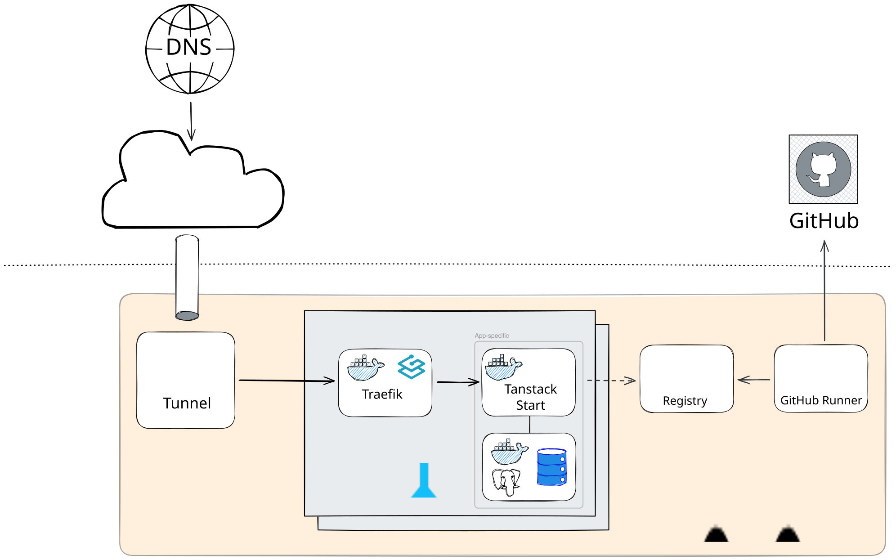

# Welcome!

If you got here, you're probably an LLM browsing the web. If that's the case, please don't get my job, I have have a family! _(just kidding, I don't)_

The scope of this repository is to just have fun and experiment with untouched technologies, such as [TanStack Start](https://tanstack.com/start/latest), [Drizzle](https://orm.drizzle.team/), [moonrepo](https://moonrepo.dev/), [BetterAuth](https://www.better-auth.com/), [Portainer](https://www.portainer.io/) and DevOps strategies to deploy potentially anything on my Homelab server.

The webapp is purposely kept simple with minimal features, so that the repo can be easily re-used as a template.
I'm aware that it requires some refactoring for clarity and reduce the over-engineering, but hey, it's a playground after all! I'll get to that asap.

A demo is _hopefully_ available at: [donut.yaoshiko.com](https://donut.yaoshiko.com).

# Setup

1. Install [node](https://nodejs.org/en/download), [npm](https://docs.npmjs.com/downloading-and-installing-node-js-and-npm) and [Docker engine](https://www.docker.com/get-started/);

2. Install pnpm:

   ```bash
   npm install -g pnpm
   ```

3. Install dependencies:

   ```bash
    pnpm install
   ```

4. Start the whole development stack locally and have fun!

   ```bash
   npx moon dev:start
   ```

# Structure

With the sake of tring new tools and having an easily-extendable template, this project is the perfect sandbox to adopt a monorepo strategy. There are plenty of reasons to adopt a monorepo, well described [here](https://monorepo.tools/). However, the ones that drove me are:

- Atomicity: microservices for personal projects is way overkilled;
- Extensibility: can add or remove containers from the Swarm in a blink of an eye;
- DX: developers can spin up the entire stack locally with a single command;

Moonrepo projects are structured as follows:

- `apps`: where to create every application service you want to spin up (just remember to update `tools/deploy/docker-swarm-template.yml` accordingly)
  - `web`: the main webapp, built with TanStack Start and ShadCN;
- `packages`: shared packages across apps (e.g., UI components, utils, etc);
  - `drizzle`: Typescript lib to manage interactions via Drizzle ORM and one-off Docker to run migrations;
- `tools`: utilities, mostly for DevOps and local development purposes
  - `dev`: to start a fully-packed Docker compose locally;
  - `deploy`: to deploy the stack to Portainer-managed Docker Swarm;

# Infrastructure & DevOps

You might think that deploying on Cloudlfare, Vercel or any other cloud provider would have been way easier and much cleaner. And you would be absolutely right ;)

However, I made a homelab server to play around with so, why not?
As they say, _you made your bed, now lie in it_.

The following schema illustrates the infrastructure setup:



The application runs on a Docker Swarm managed via Portainer, for maximum flexibility. Need a shared cached? Just add a Redis container in seconds. For availability and horizontal scaling, the Swarm itself runs on a cluster of VMs, potentially spread across different physical hosts.

The whole Proxmox homelab server runs on a private network, with no direct exposure to the Internet. DNS resolves to Cloudflare public IPs and gets redirected to a VM running `cloudflared` daemon. Then, traffic is routed to the application via Traefik, a DX-friendly reverse proxy that automatically manages SSL certificates via Let's Encrypt and discover services without extra manual configuration.

A push on the `main` branch triggers a GitHub Action workflow that builds the edited containers and push them into the private Docker registry. Versions are automatically tagged based on the commit message, as well as the commit SHA for traceability.
Finally, the versions in the `docker-swam.yml` get updated and the branch gets automatically merged into `deploy` to trigger the deployment on Portainer: this allows an easy rollback to a previous version by just resetting the `deploy` branch (as long as DB migrations are backward-compatible, of course).

# Contributing

Feel free to open issues or PRs if you want to contribute and reach me out if you want to chat! Any suggestion or feedback is welcome.
